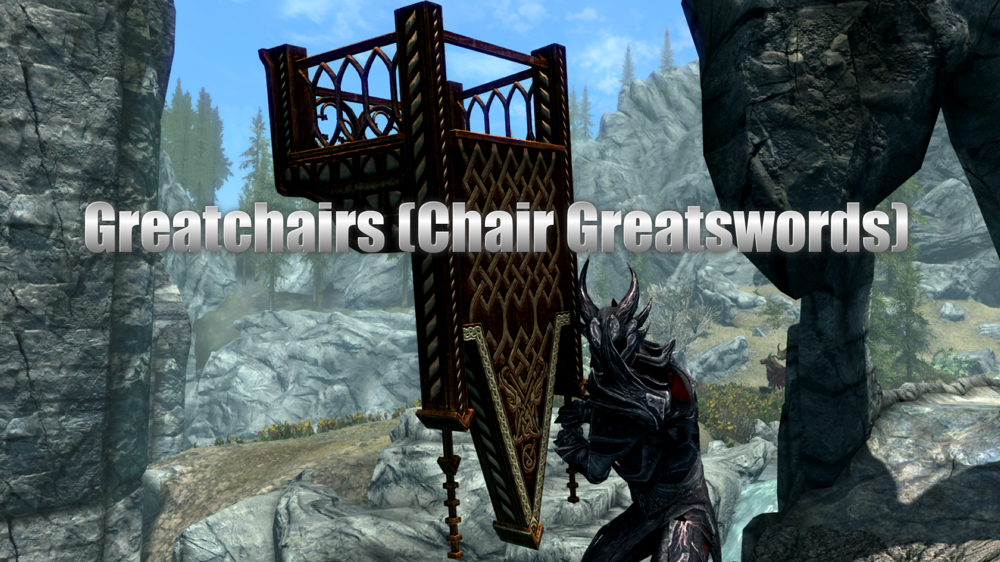

# Greatchairs (Chair Greatswords)

A Skyrim Special Edition mod By Mark E. Kraus.

My mods:

* [Chairhammers - Chair Warhammers](https://www.nexusmods.com/skyrimspecialedition/mods/61304)
* [Chairrows - Chair Arrows](https://www.nexusmods.com/skyrimspecialedition/mods/61168)
* [Cheat Jewelry](https://www.nexusmods.com/skyrimspecialedition/mods/58973)
* [Cheat Powers](https://www.nexusmods.com/skyrimspecialedition/mods/58892)
* [Exit Combat Power](https://www.nexusmods.com/skyrimspecialedition/mods/58651)
* [Greatchairs - Chair Greatswords]({NEWURL})
* [Sentient Chairs of Skyrim (SCOS)](https://www.nexusmods.com/skyrimspecialedition/mods/59604)

## About Greatchairs (Chair Greatswords)

This mod adds several Chair Greatswords to the game.

## Features

### Greatchairs

Each Greatchair is made to correspond to an equivalent vanilla greatsword.

* Iron Greatchair (similar to Iron Greatsword)
* Steel Greatchair (similar to Steel Greatsword)
* Orcish Greatchair (similar to Orcish Greatsword)
* Dwarven Greatchair (similar to Dwarven Greatsword)
* Elven Greatchair (similar to Elven Greatsword)
* Glass Greatchair (similar to Glass Greatsword)
* Ebony Greatchair (similar to Ebony Greatsword)
* Daedric Greatchair (similar to Daedric Greatsword)

## Installation

### Requirements

This mod requires [SKSE](https://skse.silverlock.org/)

### Recommended

[Static Mesh Improvement Mod - SMIM](https://www.nexusmods.com/skyrimspecialedition/mods/659). Will improve the looks of Greatchairs.

### NMM/Vortex

Download and install with Vortex and the FOMOD installer will take care of the rest.

### Manual

* Extract the 7z file using 7-Zip.
* Copy the extracted `MarkekrausGreatchairs.esp` and `MarkekrausGreatchairs.bsa` files to the `data` folder under your Skyrim: Special Edition installation folder.
* Enable the plugin using whatever method you usually use.

### Load Order

This mod can be installed in any order.

## User Guide

Greatchairs can be crafted at a blacksmith's forge using the same materials as normal greatswords of the same type. They can also be upgraded at grindstones.

Greatchairs are equipped like normal greatswords and are used the same as well.

Greatchairs can also be bought from blacksmiths and any other vendors that normally sell greatswords.

Enemies may also be armed with Greatchairs. They may attack you with them or you may find them on their dead bodies.

Greatchairs may also be found in chests.

## Compatibility

This mod should be compatible with everything.

This mod has scripted compatibility with [Valdacil's Item Sorting](https://www.nexusmods.com/skyrimspecialedition/mods/5224). No patch is required.

## Warning: Not Lore-friendly

This mod is technically not lore-friendly because chair weapons are silly.
